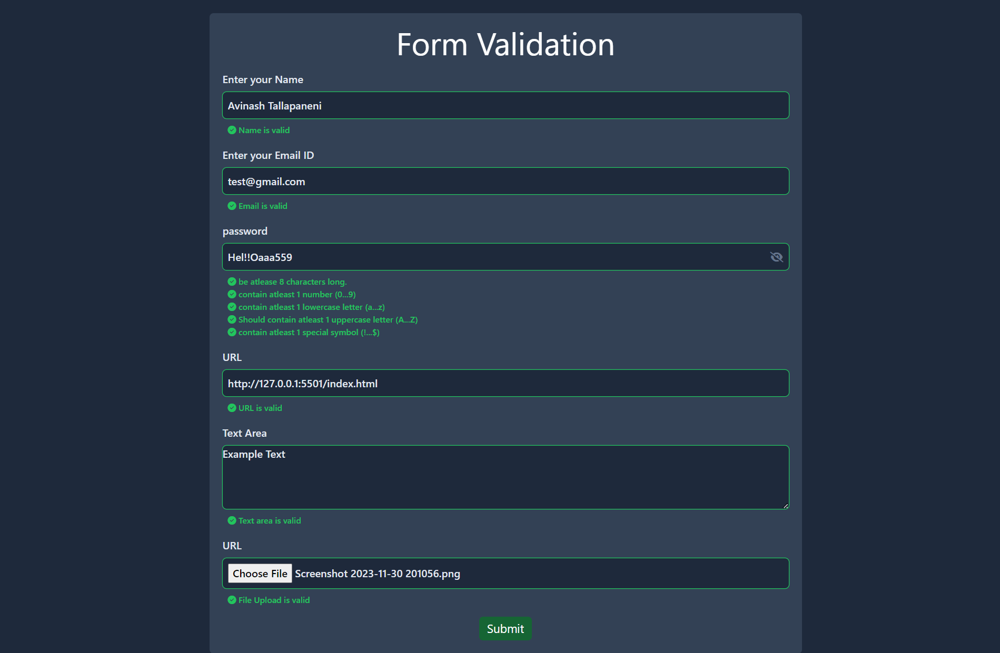
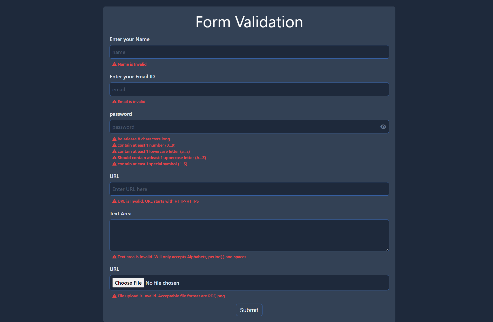

# Form validation

## Introduction

**Form validation** is a basic webpage which performs validations for different input types and appropritate message is displayed when validation fails

## Technologies Used

- vanilla js: JavaScript library for building user interfaces
- Tailwind CSS: a utility first css framework for styling

## Screenshot

## Desktop version

### Form version with valid credentials




### Form version with invalid credentials



## Getting Started

To get started with the Form validation, follow these steps:

1. Clone the repository:

   ```bash
   git clone https://github.com/Avinash-Tallapaneni/Training_files/tree/main/project5-formValidation
   ```

2. install dependencies:

   ```bash
   npm i
   ```

3. Lauch the site using

   ```bash
   npm run dev
   ```

# Folder Structure

Folder structure will be included as the project grows

# Contributing

Contributions to the Form validations are welcome! If you find any bugs or have suggestions for improvements, please create an issue or submit a pull request.

## Author

My name is Avinash Tallapaneni, and I am a front-end web developer passionate about creating immersive and engaging user experiences. Form validations is a project that showcases my skills and dedication to building high-quality web applications.

- GitHub - [GitHub Profile](https://github.com/avinash-tallapaneni)
- Twitter - [Twitter Profile](https://twitter.com/TallapaneniAvi)

## Feedback

I appreciate any feedback you have on Form validations. If you have any suggestions, bug reports, or general feedback, please feel free to

# License

This project is licensed under the MIT License.
Feel free to modify the content to match your project and provide additional information as needed.
